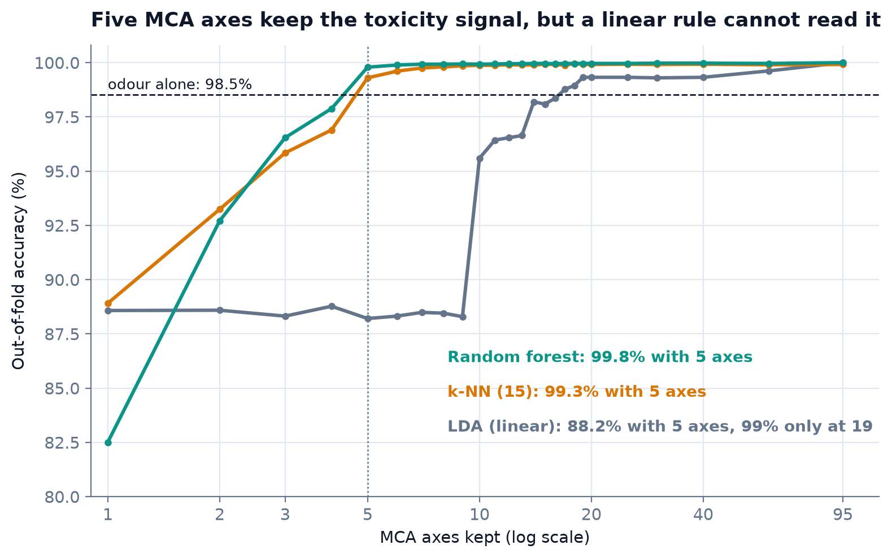

# mushroom-project (version française)

**Cinq axes d'analyse des correspondances multiples (ACM) gardent assez du signal de toxicité des données UCI Mushroom pour une forêt aléatoire (99,8 %), mais pas pour la LDA (88,2 %), et la première version de cette étude l'a manqué à cause de plis non mélangés.**

*English version (référence) : [README.md](README.md). Rapport interactif : [pchambet.github.io/mushroom-project](https://pchambet.github.io/mushroom-project/).*



## En bref

- **Les données sont presque parfaitement séparables.** L'odeur seule classe correctement 98,52 % des spécimens hors échantillon (exactitude, ou *accuracy*) ; un arbre de décision de profondeur 7 (14 feuilles) sur le tableau disjonctif atteint 100 %. Classer n'est pas la difficulté.
- **Cinq axes ACM gardent l'information, mais pas sous une forme linéaire.** Sur les mêmes cinq axes, la LDA obtient 88,2 %, une forêt aléatoire 99,8 % et un vote des 15 plus proches voisins 99,3 %. La LDA reste à 88,8 % au plus jusqu'à neuf axes et doit en garder 19 pour atteindre 99 %. Avec les 85 axes, elle atteint 100 %, car l'étiquette est une fonction linéaire exacte des 116 indicatrices : ce que la LDA ne sait pas lire, c'est la compression à cinq axes, pas les données.
- **Inertie n'est pas pertinence.** L'axe 1 porte la moitié de l'étiquette (η² = 0,51) ; les axes 2 à 9 au plus 0,09, alors que l'axe 10, avec seulement 2,3 % de l'inertie, atteint 0,14 ; la LDA passe de 88,3 % à 95,5 % quand il entre.
- **L'erreur qui compte est asymétrique.** Les 120 erreurs de la règle « odeur » sont toutes des champignons vénéneux déclarés comestibles (espèces vénéneuses sans odeur) ; la LDA sur cinq axes en commet 816, la forêt aléatoire 10.
- **La première version de ce projet lisait mal sa validation croisée.** Le `cv=5` de scikit-learn est stratifié mais non mélangé, et le fichier UCI est ordonné par profil de descripteurs (en gros, par espèce) : chaque pli de test était un bloc contigu dont certaines modalités n'apparaissent jamais à l'apprentissage (dans le pli 5, 346 des 1 624 spécimens portent l'une de 14 modalités absentes de l'apprentissage ; tous les plis restent à 48,2 % de vénéneux). L'écart de ±14,8 points qui en résultait a été lu comme un « modèle instable » et une forêt aléatoire « en surapprentissage ». Avec des plis stratifiés mélangés, l'écart tombe à ±1,0 point et la forêt aléatoire est le meilleur modèle sur les axes ACM. L'écart non mélangé n'est pas que du bruit : c'est une mesure grossière de la performance sur des espèces absentes de l'apprentissage.

## Démarche

1. **Données.** UCI Mushroom (8 124 spécimens, 22 descripteurs), téléchargées une fois et vérifiées par somme de contrôle. Les codes sont décodés avec le dictionnaire UCI ; les 2 480 valeurs inconnues de `stalk-root` deviennent une modalité `missing` plutôt qu'une imputation ; `veil-type`, constante, est retirée. Résultat : 21 variables, 116 modalités et 85 axes d'inertie non nulle (la borne J − Q = 95 n'est pas atteinte, car certains descripteurs sont exactement redondants).
2. **ACM.** Une implémentation numpy courte, sous forme de transformeur scikit-learn : elle est réajustée dans chaque pli d'apprentissage et le pli de test est projeté par la formule de transition. Elle ne garde que les axes au-dessus de la tolérance du rang numérique ; ses valeurs propres et coordonnées coïncident avec celles de `prince` (testé).
3. **Évaluation.** Cinq plis stratifiés mélangés (`random_state=42`) pour tous les scores ; l'ACM, l'encodage et le classifieur sont dans un même pipeline. Chaque modèle rapporte aussi le nombre de vénéneux déclarés comestibles. La LDA utilise un rétrécissement de Ledoit-Wolf (voir les limites).

## Ce qui a été corrigé par rapport à la première version

| Affirmation initiale | Ce que montrent les données |
|---|---|
| « LDA instable : 77,1 % ± 14,0 % » | Les plis non mélangés testaient des blocs de modalités absentes de l'apprentissage ; avec des plis mélangés, 88,2 % ± 1,0 % d'exactitude |
| « La forêt aléatoire surapprend » | Elle obtient 99,8 % ± 0,1 % hors échantillon sur cinq axes |
| « k = 4 axes est optimal » | Le choix venait du bruit des plis ; la LDA plafonne vers 88 % jusqu'à 9 axes |
| « 8 axes concentrent 90 % de l'information » | 90 % des *dix premiers* axes, qui portent 48,3 % de l'inertie totale |
| « Quand le modèle dit comestible, il a raison à 97,6 % » | 97,6 % était le rappel des comestibles ; la précision était de 83,5 % |

## Reproduire

```bash
make setup && make data && make run && make report   # environ 3 min réelles sur un portable (5 min de CPU)
make test lint
```

## Limites

Les enregistrements sont des spécimens hypothétiques générés à partir d'un guide de terrain pour 23 espèces, pas des observations ; les plis aléatoires mesurent la reconnaissance d'espèces connues, pas d'une espèce nouvelle. Rien ici n'est un conseil de cueillette.

La borne J − Q = 95 n'est pas atteinte : le tableau disjonctif centré est de rang 85, et les dix valeurs singulières restantes, sous la tolérance de rang de numpy (erreur d'arrondi), sont écartées. Les garder n'est pas anodin : ce bruit d'arrondi est une fonction déterministe des modalités de chaque ligne, si bien qu'un axe nul peut être corrélé à l'étiquette : dans une version antérieure qui les gardait, l'axe d'arrondi 90 atteignait η² = 0,34, plus que tout axe réel sauf l'axe 1, et la LDA par défaut, qui remet chaque colonne à variance unité, peut apprendre sur un tel axe. L'étiquette étant une fonction linéaire exacte des indicatrices, la covariance intra-classe des 85 axes est singulière dans la direction qui sépare les classes ; le solveur SVD par défaut de scikit-learn l'écarte (64,5 %), le rétrécissement de Ledoit-Wolf la garde (100 %). Jusqu'à 80 axes, les deux solveurs ne diffèrent jamais de plus de 4 spécimens.

---

Réalisé par [Pierre Chambet](https://github.com/Pchambet) — decision science for operations under uncertainty.
