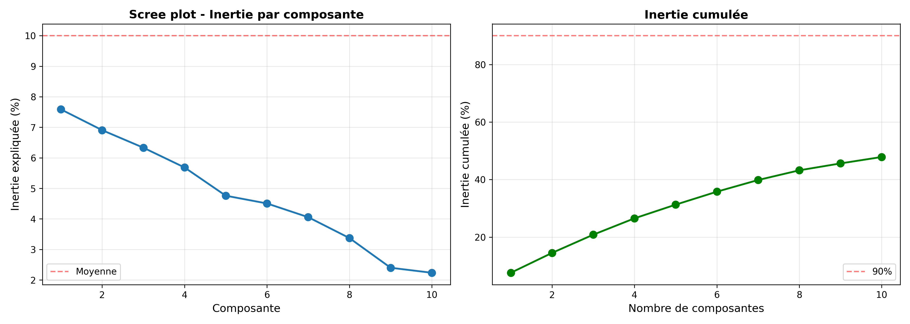
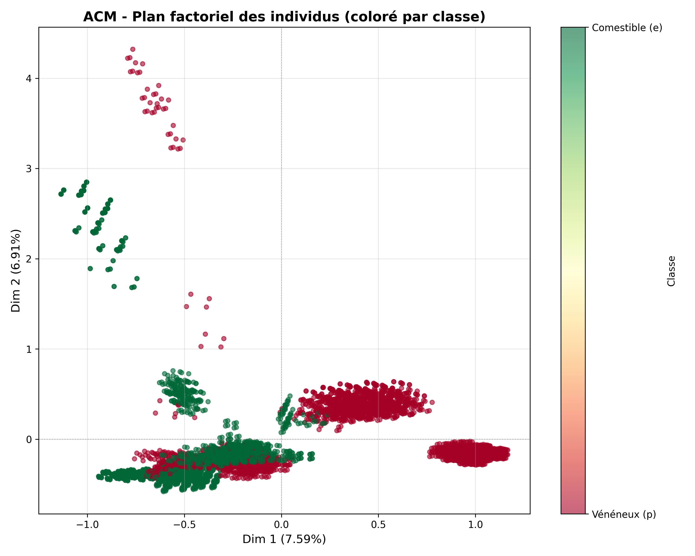
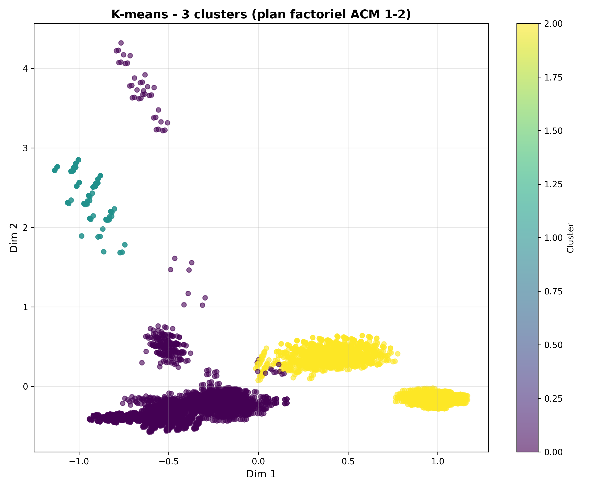
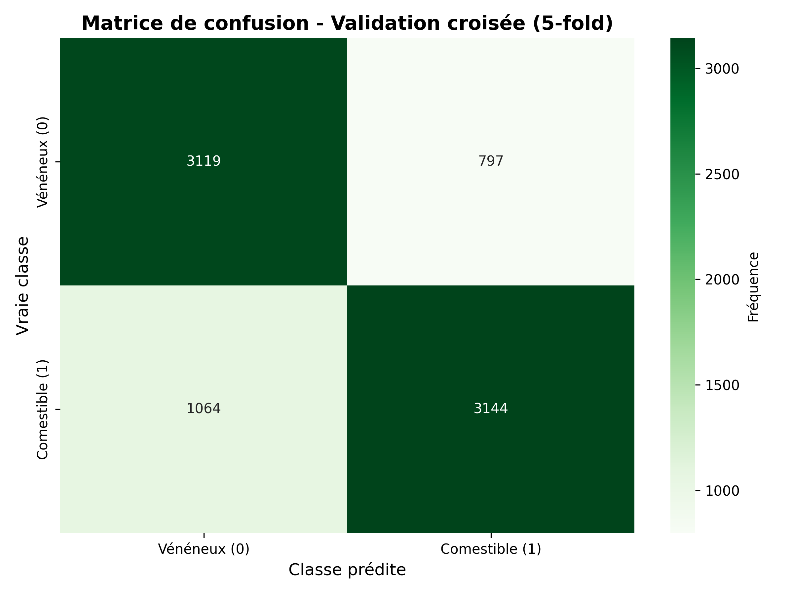
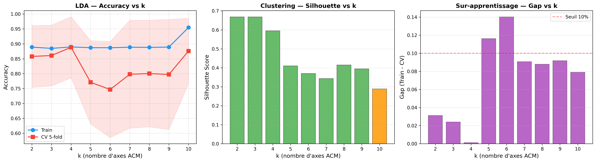
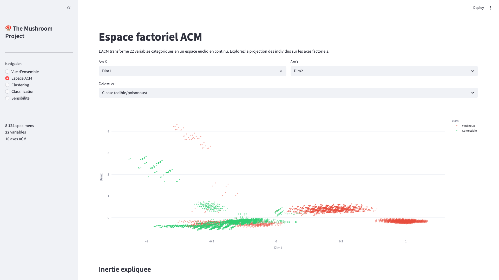

<p align="center">
  
</p>

<p align="center">
  
  
  <a href="https://pchambet-mushroom-project.streamlit.app/"></a>
  
</p>

---

Un champignon devant vous. Chapeau convexe, odeur anisée, lamelles libres, anneau pendant.

**Comestible ou mortel ?**

Un mycologue expérimenté croise ces indices mentalement, en une seconde. Mais comment faire comprendre cela à une machine ?

Parce que le vrai problème, ce n'est pas la classification. C'est que **toutes ces informations sont des mots**. « Convexe », « anis », « libre », « pendant » — pas un seul chiffre. Or les algorithmes de machine learning ont besoin de nombres pour calculer des distances, tracer des frontières, regrouper des points. Face à des mots, ils sont aveugles.

La vraie question de ce projet :

> **Comment transformer des mots en géometrie pour prédire la toxicité ?**
> **Comment extraire du sens calculable à partir de descriptions qualitatives ?**

Pour y répondre, on suit une démarche en cinq temps. Chacun construit sur le précédent. Aucun ne peut être sauté.

```
Observer  →  Transformer  →  Découvrir  →  Prédire  →  Interroger
```

---

## 1. Observer

8 124 champignons. 22 caractéristiques chacun. Toutes catégorielles — c'est-à-dire des étiquettes, pas des chiffres. La forme du chapeau peut être « convexe », « plate » ou « en cloche ». L'odeur peut être « anis », « fétide » ou « aucune ». La couleur des lamelles, le type d'anneau, l'habitat — tout est du texte.

La variable cible est binaire : **comestible (e)** ou **vénéneux (p)**. La répartition est quasi équilibrée — 51,8 % de comestibles, 48,2 % de vénéneux. Pas de déséquilibre majeur à corriger.

Une seule variable présente des données manquantes : `stalk-root` (la racine du pied), avec 30,5 % de valeurs inconnues. On les impute par la modalité la plus fréquente — c'est le choix standard lorsqu'on ne souhaite pas perdre d'individus.

À ce stade, on dispose d'un tableau de mots. On ne peut rien calculer dessus. Pas de moyenne, pas de distance, pas de modèle. Il faut **transformer**.

---

## 2. Transformer — ce que fait réellement l'ACM

C'est l'étape clé de tout le projet. L'**Analyse en Composantes Multiples** (ACM) transforme un tableau de mots en un tableau de nombres. Voici comment.

### L'idée

Imaginons un champignon décrit par trois caractéristiques : `odeur = anis`, `chapeau = convexe`, `habitat = forêt`. L'ACM commence par « éclater » chaque caractéristique en autant de colonnes qu'il y a de modalités possibles, avec des 0 et des 1 :

```
                 odeur_anis  odeur_foul  odeur_none  chapeau_convexe  chapeau_plat  habitat_forêt  habitat_prairie
Champignon #1:      1           0           0             1               0              1              0
Champignon #2:      0           1           0             0               1              0              1
...
```

Ce tableau s'appelle le **tableau disjonctif complet**. Pour 22 variables et environ 100 modalités au total, il compte 8 124 lignes × ~100 colonnes de 0 et de 1.

### La mécanique

Ce tableau de 0/1 est désormais numérique. On peut y calculer des distances, des moyennes, des variances. L'ACM recherche les **axes de plus grande variabilité** dans ce tableau — les directions le long desquelles les champignons diffèrent le plus les uns des autres. Il s'agit d'une technique de diagonalisation matricielle : on décompose la structure de ce vaste tableau en composantes ordonnées, de la plus informative à la moins informative.

Les coordonnées de chaque champignon sur ces axes deviennent ses **nouvelles variables** : des nombres réels, continus, exploitables.

### Le résultat

```
22 variables textuelles                    ACM                     10 axes numériques
┌─────────────────────┐      ┌──────────────────────┐      ┌────────────────────┐
│ odeur = anis        │      │ Tableau disjonctif    │      │ Dim1 = -0.342      │
│ chapeau = convexe   │  →   │ (8124 x ~100, en 0/1)│  →   │ Dim2 =  0.891      │
│ lamelles = libres   │      │ Diagonalisation       │      │ Dim3 = -0.127      │
│ anneau = pendant    │      │ (axes de variabilité) │      │ ...                │
│ ...22 variables     │      └──────────────────────┘      │ Dim10 = 0.045      │
└─────────────────────┘                                     └────────────────────┘
```

Chaque champignon possède désormais une position sur une carte à 10 dimensions. On peut calculer des distances entre eux. On peut les regrouper. On peut tracer des frontières. **C'est ce pont — du texte vers la géométrie — qui rend tout le reste possible.**

### Ce que chaque axe capture

Tous les axes ne se valent pas. Le premier capture 15,9 % de l'information totale, le deuxième 14,4 %, et ainsi de suite. À eux seuls, les huit premiers axes concentrent 90 % de l'information.

<p align="center">
  
</p>

Pas de coupure nette entre les axes — c'est **normal** pour des données catégorielles. En ACP (son équivalent pour des données numériques), on cherche un « coude » dans ce graphique pour choisir combien d'axes conserver. Ici, l'inertie décroît progressivement parce que les ~100 modalités contribuent chacune un peu.

Et le plus remarquable : **l'axe 1 est un « axe de sécurité alimentaire »**. Les modalités qui y contribuent le plus sont `odeur = fétide`, `surface du pied = soyeuse`, `type d'anneau = pendant` — exactement les critères qu'un mycologue utilise pour évaluer la toxicité. L'ACM a retrouvé, de manière purement mathématique, l'expertise humaine.

### Le moment décisif

Dès que l'on place les 8 124 champignons sur les deux premiers axes :

<p align="center">
  
</p>

Les comestibles (en vert) et les vénéneux (en rouge) **se séparent naturellement**. L'algorithme ne connaît même pas les étiquettes. Il a simplement lu les descriptions et découvert, de lui-même, que les champignons dangereux ne ressemblent pas aux autres.

Cela signifie que l'information de toxicité est **encodée dans la morphologie**. La transformation a fonctionné. On peut passer à l'étape suivante.

---

## 3. Découvrir — ce que le clustering révèle

Avant de prédire, on explore. On pose à un algorithme une question simple : **« Existe-t-il des groupes naturels dans cet espace ? »** — sans lui indiquer lesquels chercher.

C'est cela, le **clustering** : regrouper des points qui se ressemblent, sans étiquettes, sans supervision. L'algorithme mesure des distances dans l'espace ACM et répartit les champignons en groupes homogènes.

### Deux approches complémentaires

**La CAH (Classification Ascendante Hiérarchique)** construit un arbre — le dendrogramme. En bas, chaque champignon est seul. On fusionne progressivement les deux points les plus proches, puis les deux groupes les plus proches, et l'on remonte. L'arbre indique à quelle échelle les groupes se forment. La méthode Ward minimise la variabilité à l'intérieur de chaque groupe à chaque fusion.

**Le K-Means** adopte une approche directe : on fixe un nombre de groupes (ici k = 3, guidé par le dendrogramme), et l'algorithme place trois centres dans l'espace puis assigne chaque champignon au centre le plus proche. Il ajuste itérativement les centres jusqu'à convergence.

Les deux méthodes convergent vers **3 groupes naturels** :

<p align="center">
  
  
</p>

| Cluster | Taille | Composition | Pureté |
|---|---|---|---|
| **0** | 4 824 (59,4 %) | 82 % comestible | Mixte |
| **1** | 192 (2,4 %) | 100 % comestible | **Pur** |
| **2** | 3 108 (38,3 %) | 98,2 % vénéneux | **Quasi pur** |

### Ce que cela signifie

**Le Cluster 1** : 192 champignons, **100 % comestibles**. Zéro erreur. Ce sont des spécimens aux caractéristiques tellement distinctives qu'ils forment un îlot isolé dans l'espace. Si un champignon tombe dans ce cluster, il est comestible — garanti.

**Le Cluster 2** : 3 108 champignons, **98,2 % vénéneux**. C'est le signal d'alarme. Si un champignon s'y retrouve, il est quasi certainement dangereux.

**Le Cluster 0** : la **zone grise**. 59,4 % du jeu de données, mélange 82/18. Le clustering seul ne suffit pas pour départager ces champignons. C'est précisément là qu'un modèle de prédiction va prendre le relais.

Et rappelons-le : l'algorithme n'a **jamais vu l'étiquette** « comestible » ou « vénéneux ». Il a simplement mesuré des proximités. Le fait qu'il retrouve des groupes quasi purs **valide l'ensemble de la chaîne en amont** : les données sont fiables, la transformation ACM est pertinente, la structure est réelle.

Alors, si la structure est bien là… peut-on réellement prédire ?

---

## 4. Prédire — tracer la frontière

Pour prédire, il faut un modèle qui **apprend la frontière** entre comestibles et vénéneux à partir d'exemples étiquetés. Contrairement au clustering (qui ignore les étiquettes), on montre ici au modèle des champignons dont on connaît la classe, et il apprend la règle de séparation.

### L'Analyse Discriminante Linéaire (LDA)

La LDA recherche la **meilleure droite de séparation** dans l'espace ACM. Imaginez les champignons comme des points sur un plan. La LDA trace la ligne qui maximise l'écart entre les comestibles d'un côté et les vénéneux de l'autre, tout en minimisant la dispersion à l'intérieur de chaque groupe.

C'est le prolongement naturel de l'ACM : là où l'ACM identifie les axes de plus grande variabilité globale, la LDA trouve l'axe de plus grande variabilité **entre les classes**.

### Évaluer honnêtement

Un modèle qui obtient 88,7 % de bonnes réponses sur les données d'entraînement, c'est encourageant. Mais sait-il généraliser ? A-t-il véritablement appris la règle, ou a-t-il simplement mémorisé les exemples ?

Pour le savoir, on recourt à la **validation croisée** : on découpe les 8 124 champignons en cinq parts égales. On entraîne le modèle sur quatre parts, on le teste sur la cinquième. Puis on tourne — cinq fois, chaque part servant de test une fois. C'est la seule manière de mesurer la performance réelle.

<p align="center">
  
  
</p>

| Métrique | Signification | Valeur |
|---|---|---|
| Accuracy | Le modèle donne la bonne réponse dans X % des cas | **88,7 %** |
| Précision vénéneux | Lorsqu'il déclare « dangereux », il a raison à | **96,8 %** |
| Recall comestible | Lorsqu'un champignon est comestible, il le détecte à | **97,6 %** |
| CV 5-fold | Performance sur des données jamais vues | **77,1 % ± 14,0 %** |

Lorsque le modèle déclare « mange-le », il a raison 97,6 % du temps. Pas mal pour un algorithme qui partait de mots.

Mais 77,1 % en validation croisée, avec un écart-type de 14,0 %, signifie que sur certains découpages le modèle descend à ~60 %. **Il n'est pas stable.** Cela soulève des questions — et c'est précisément le sujet de l'étape suivante.

---

## 5. Interroger — remettre en question ses propres choix

C'est l'étape que la plupart des projets de data science escamotent. On dispose d'un résultat — 88,7 % d'accuracy — et l'on s'arrête là. Ici, on pose deux questions supplémentaires.

### Combien d'axes conserver ?

On a utilisé cinq axes ACM. Pourquoi pas trois ? Pourquoi pas huit ? Est-ce qu'ajouter de l'information améliore systématiquement la prédiction ?

On teste méthodiquement de 2 à 10 axes :

<p align="center">
  
</p>

Résultat contre-intuitif : **quatre axes offrent la meilleure performance (88,9 %)**, davantage que cinq (77,1 %) ou huit (80,0 %).

Pourquoi ? Parce que les axes supplémentaires n'apportent pas uniquement de l'information utile — ils véhiculent aussi du **bruit**. Le cinquième axe, par exemple, capture des variations sans lien avec la toxicité. Le modèle linéaire, en tentant d'intégrer ce bruit, perd en précision. C'est un phénomène classique en statistique : la **malédiction de la dimensionnalité** — plus n'est pas toujours mieux.

En data science, **savoir quoi retirer compte autant que savoir quoi conserver.**

### Quel modèle choisir ?

La LDA trace une frontière linéaire — une droite, en somme. Mais d'autres modèles savent tracer des frontières plus complexes :

- Le **Random Forest** combine des centaines d'arbres de décision. Chaque arbre pose des questions simples (« odeur = fétide ? »), et l'on fait voter l'ensemble.
- Le **SVM** (Support Vector Machine) déforme mathématiquement l'espace pour qu'une frontière linéaire dans cet espace déformé corresponde à une frontière courbe dans l'espace original.
- La **Régression Logistique** estime la probabilité d'appartenance à chaque classe via une fonction sigmoïde.

Quatre classifieurs, les mêmes coordonnées ACM. Qui l'emporte ?

<p align="center">
  
</p>

<p align="center">
  
</p>

| Modèle | Entraînement | Données jamais vues | F1 |
|---|---|---|---|
| **Random Forest** | 99,9 % | **85,3 %** | **0,853** |
| SVM | 96,3 % | 82,6 % | 0,826 |
| LDA | 88,7 % | 77,1 % | 0,771 |
| Logistic Regression | 88,6 % | 74,7 % | 0,747 |

Le Random Forest l'emporte en performance brute. Mais observez la colonne « Entraînement » : **99,9 %**. Quasi parfait. Et sur des données jamais vues : 85,3 %. Cet écart porte un nom — **l'overfitting**. Le modèle a mémorisé les exemples au lieu d'apprendre la règle.

C'est comme un étudiant qui retient les réponses du QCM sans comprendre le cours : brillant à l'examen blanc, fragile le jour J.

La LDA, avec un écart bien plus faible entre entraînement et test (11,6 % contre 14,6 % pour le Random Forest), demeure **le modèle le plus honnête**. Moins performant, mais plus fiable. Le choix entre performance brute et fiabilité n'admet pas de réponse universelle — et le reconnaître fait partie de la rigueur.

---

## Ce que cette démarche révèle

```
Observer  →  Transformer  →  Découvrir  →  Prédire  →  Interroger
   |              |              |             |              |
 8124 × 22     ACM →         Clustering    LDA →         Sensibilité
 variables     coordonnées   3 groupes     88,7 %        k=4 optimal
 textuelles    numériques    quasi purs    accuracy      RF overfitte
```

Chaque étape répond à la question soulevée par la précédente. Et l'ensemble révèle quelque chose de plus profond : la toxicité d'un champignon est **encodée dans sa morphologie**, de manière suffisamment forte pour qu'un algorithme, partant de simples descriptions textuelles, puisse la retrouver — à condition d'utiliser la bonne transformation.

---

## Explorer par vous-même

Tout ce qui précède est interactif. Le dashboard permet de changer les axes, d'ajuster les clusters, de comparer les modèles — et de voir les résultats évoluer en temps réel.

> **[Ouvrir le dashboard](https://pchambet-mushroom-project.streamlit.app/)** — aucune installation requise.

<p align="center">
  
</p>

<details>
<summary><strong>Aperçu des pages</strong></summary>

**Espace ACM** — choisir les axes, colorer par classe ou par cluster :

<p align="center">
  
</p>

**Clustering** — ajuster les paramètres et observer les groupes se former :

<p align="center">
  
</p>

</details>

---

## Reproduire

```bash
git clone https://github.com/Pchambet/mushroom-project.git
cd mushroom-project

make install       # Environnement virtuel + dépendances
make run-all       # Pipeline complet (00 → 07)
make dashboard     # Dashboard en local
```

<details>
<summary><strong>Toutes les commandes</strong></summary>

```bash
make install       # Créer l'environnement + dépendances
make run-all       # Pipeline complet (scripts 00 à 07)
make run-A         # Download → Prepare → Describe → ACM
make run-B         # Clustering → Discriminante
make run-extended  # Sensibilité + Comparaison de modèles
make dashboard     # Lancer le dashboard Streamlit
make clean         # Supprimer les outputs
make distclean     # Nettoyage complet (outputs + venv)
make help          # Aide
```

</details>

---

## Architecture

```
mushroom-project/
├── src/                              # Pipeline (9 scripts)
│   ├── 00_download.py                #   Acquisition UCI
│   ├── 01_prepare.py                 #   Nettoyage
│   ├── 02_describe.py                #   Statistiques descriptives
│   ├── 03_mca.py                     #   ACM
│   ├── 04_cluster.py                 #   CAH + K-Means
│   ├── 05_discriminant.py            #   LDA
│   ├── 06_sensitivity.py             #   Sensibilité (impact de k)
│   ├── 07_model_comparison.py        #   LDA vs RF vs SVM vs LogReg
│   └── utils.py                      #   Helpers
├── app.py                            # Dashboard Streamlit
├── reports/figures/                   # Figures (300 DPI)
├── reports/tables/                    # Tables CSV
├── data/                              # Données brutes + traitées
├── docs/                              # Audit, dictionnaire
├── Makefile                           # Orchestration
└── requirements.txt                   # Dépendances
```

---

## En profondeur

| Document | Description |
|---|---|
| [`docs/AUDIT_COMPLET.md`](docs/AUDIT_COMPLET.md) | **Audit multi-expert** — 8 perspectives (mathématicien, data engineer, classification, clustering, visualisation, code, product) |
| [`docs/data_dictionary.md`](docs/data_dictionary.md) | Dictionnaire des 23 variables et modalités |

---

## Stack

| Composant | Librairie |
|---|---|
| ACM | [`prince`](https://github.com/MaxHalford/prince) |
| Clustering | `scikit-learn`, `scipy` |
| Classification | `scikit-learn` (LDA, LogReg, RF, SVM) |
| Dashboard | `streamlit`, `plotly` |
| Visualisation | `matplotlib`, `seaborn` |

---

MIT — [`LICENSE`](LICENSE)
