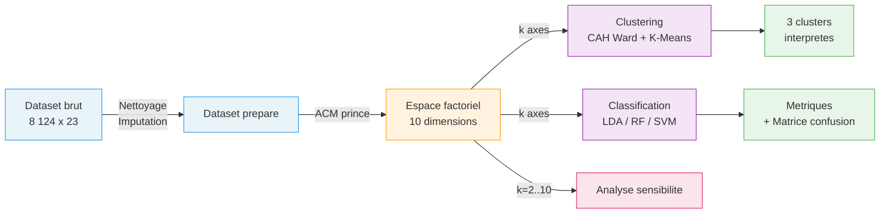

<p align="center">
  
  
  
  
</p>

<h1 align="center">The Mushroom Project</h1>

<p align="center">
  <strong>Pipeline d'analyse statistique sur donnees categorielles</strong><br>
  <em>De la reduction dimensionnelle (ACM) au clustering et a la classification</em>
</p>

---

## Identite du projet

The Mushroom Project resout un probleme fondamental : **comment appliquer des outils statistiques classiques (K-Means, LDA) a des donnees purement categoriques ?**

22 variables nominales decrivent la morphologie de 8 124 champignons — forme du chapeau, odeur, couleur des lamelles, type d'anneau. Aucune n'est numerique. L'**Analyse en Composantes Multiples (ACM)** est le pont mathematique qui rend tout le reste possible :

```
22 variables categorielles    →    ACM    →    Espace euclidien continu    →    Modeles
   (8 124 champignons)          10 axes        Distances exploitables         K-Means + LDA
                                               Visualisation possible         RF + SVM
```

---

## Resultats

### ACM — Les champignons dans l'espace factoriel

L'ACM projette les 8 124 specimens dans un espace continu. Sur les deux premiers axes, on voit deja une **separation nette** entre comestibles (vert) et venéneux (rouge) :

<p align="center">
  
</p>

Le scree plot montre la repartition de l'inertie sur les 10 axes. Pas de coude franc — typique des donnees categoriques. 90% d'inertie cumulee a 8 axes.

<p align="center">
  
</p>

### Clustering — Structures naturelles

Le dendrogramme (CAH Ward) guide le choix de 3 clusters. Le K-Means revele un **cluster 100% comestible** et un **cluster 98.2% venéneux** :

<p align="center">
  
  
</p>

| Cluster | Taille | Comestibles | Venéneux | Purete |
|---|---|---|---|---|
| **0** | 4 824 (59.4%) | 3 961 | 863 | Mixte (82% e) |
| **1** | 192 (2.4%) | 192 | 0 | **100% comestible** |
| **2** | 3 108 (38.3%) | 55 | 3 053 | **98.2% venéneux** |

### Classification — LDA et validation croisee

L'analyse discriminante lineaire sur les 5 premiers axes ACM : **88.7% d'accuracy**, avec un recall de 97.6% sur les comestibles. La matrice de confusion en validation croisee 5-fold :

<p align="center">
  
  
</p>

| Metrique | Valeur |
|---|---|
| Accuracy (train) | **88.7%** |
| Precision venéneux | **96.8%** |
| Recall comestible | **97.6%** |
| CV 5-fold | **77.1% +/- 14.0%** |

### Analyse de sensibilite — Pourquoi k=4 et pas k=8 ?

L'ajout de dimensions ACM ne garantit pas de meilleures performances. **k=4 axes donne la meilleure accuracy CV (88.9%)**, mieux que k=5 (77.1%) ou k=8 (80.0%) :

<p align="center">
  
</p>

### Comparaison de modeles — LDA vs Random Forest vs SVM vs LogReg

4 classifieurs sur les memes coordonnees ACM. Random Forest domine en accuracy, mais avec un **overfitting massif** (99.9% train vs 85.3% CV) :

<p align="center">
  
</p>

<p align="center">
  
</p>

| Modele | Train | CV 5-fold | F1 (macro) |
|---|---|---|---|
| **Random Forest** | 99.9% | **85.3%** | **0.853** |
| SVM (RBF) | 96.3% | 82.6% | 0.826 |
| LDA | 88.7% | 77.1% | 0.771 |
| Logistic Regression | 88.6% | 74.7% | 0.747 |

---

## Methodologie



---

## Demarrage rapide

```bash
git clone https://github.com/Pchambet/mushroom-project.git
cd mushroom-project

make install       # Environnement virtuel + dependances
make run-all       # Pipeline complet (00 → 07)
make dashboard     # Lancer le dashboard interactif
```

<details>
<summary><strong>Toutes les commandes</strong></summary>

```bash
make install       # Creer l'environnement virtuel + installer les dependances
make run-all       # Pipeline complet (scripts 00 a 07)
make run-A         # Download → Prepare → Describe → ACM
make run-B         # Clustering → Discriminante
make run-extended  # Sensibilite + Comparaison modeles
make validate      # Valider le contrat d'interface
make dashboard     # Lancer le dashboard Streamlit
make clean         # Supprimer tous les outputs generes
make distclean     # Nettoyage complet (outputs + venv)
make help          # Afficher l'aide
```

</details>

---

## Architecture

```
mushroom-project/
├── src/                              # Pipeline (10 scripts)
│   ├── 00_download.py                #   Acquisition UCI
│   ├── 01_prepare.py                 #   Nettoyage
│   ├── 02_describe.py                #   Stats descriptives
│   ├── 03_mca.py                     #   ACM
│   ├── 04_cluster.py                 #   CAH + K-Means
│   ├── 05_discriminant.py            #   LDA
│   ├── 06_sensitivity.py             #   Sensibilite (impact de k)
│   ├── 07_model_comparison.py        #   LDA vs RF vs SVM vs LogReg
│   ├── utils.py                      #   Helpers
│   └── validate_interface.py         #   Validation
├── app.py                            # Dashboard Streamlit
├── reports/figures/                   # 16 figures (300 DPI)
├── reports/tables/                    # 12 tables CSV
├── data/                              # Raw + processed
├── docs/                              # Audit, dictionnaire, specs
├── .github/workflows/pipeline.yml     # CI (Python 3.10 + 3.11)
├── Makefile                           # Orchestration
└── requirements.txt                   # Dependances
```

---

## Documentation

| Document | Description |
|---|---|
| [`docs/AUDIT_COMPLET.md`](docs/AUDIT_COMPLET.md) | **Audit approfondi** — synergie, architecture, resultats, qualite |
| [`docs/data_dictionary.md`](docs/data_dictionary.md) | Dictionnaire des 23 variables et modalites |
| [`docs/INTERFACE_SPEC.md`](docs/INTERFACE_SPEC.md) | Contrat d'interface (`mca_coords.csv`) |
| [`docs/FAQ.md`](docs/FAQ.md) | Questions frequentes |

---

## Stack

| Composant | Librairie |
|---|---|
| ACM | [`prince`](https://github.com/MaxHalford/prince) |
| Clustering | `scikit-learn`, `scipy` |
| Classification | `scikit-learn` (LDA, LogReg, RF, SVM) |
| Dashboard | `streamlit`, `plotly` |
| Visualisation | `matplotlib`, `seaborn` |

---

MIT — [`LICENSE`](LICENSE)
