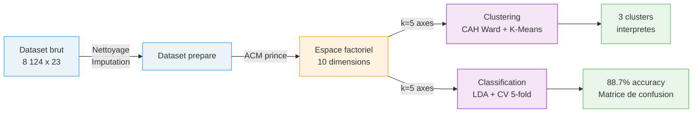

<p align="center">
  
  
  
  
</p>

<h1 align="center">The Mushroom Project</h1>

<p align="center">
  <strong>Pipeline d'analyse statistique sur donnees categorielles</strong><br>
  <em>De la reduction dimensionnelle (ACM) au clustering et a la classification</em>
</p>

---

## Identite du projet

The Mushroom Project resout un probleme fondamental : **comment appliquer des outils statistiques classiques (K-Means, LDA) a des donnees purement categoriques ?**

22 variables nominales decrivent la morphologie de 8 124 champignons — forme du chapeau, odeur, couleur des lamelles, type d'anneau. Aucune n'est numerique. Les distances euclidiennes, les moyennes, les variances n'ont pas de sens sur ces donnees brutes.

L'**Analyse en Composantes Multiples (ACM)** est le pont mathematique qui rend tout le reste possible :

```
22 variables categorielles    →    ACM    →    Espace euclidien continu    →    Modeles
   (8 124 champignons)          10 axes        Distances exploitables         K-Means + LDA
                                               Visualisation possible         RF + SVM
```

Sans cette transformation, ni le clustering ni la classification ne fonctionneraient. L'ACM n'est pas une etape parmi d'autres — c'est le fondement du pipeline.

Le projet va au-dela de l'analyse initiale en incluant une **analyse de sensibilite** (impact du choix de k) et une **comparaison de 4 classifieurs** pour contextualiser les resultats. Un **dashboard Streamlit** permet d'explorer l'ensemble de maniere interactive.

---

## Resultats cles

| Methode | Metrique | Valeur |
|---|---|---|
| **ACM** | Inertie cumulee (8 axes) | **90.3%** |
| **K-Means** | Cluster pur comestible | **100%** (192 specimens) |
| **K-Means** | Cluster predominant venéneux | **98.2%** (3 108 specimens) |
| **LDA** | Accuracy (entrainement) | **88.7%** |
| **LDA** | Recall comestible | **97.6%** |
| **LDA** | Precision venéneux | **96.8%** |
| **LDA** | Accuracy CV 5-fold | **77.1% +/- 14.0%** |

**Principaux discriminants** : odeur (`odor`), surface du pied (`stalk-surface`), type d'anneau (`ring-type`).

Le clustering revele une structure naturelle nette dans l'espace ACM : un groupe exclusivement comestible et un groupe quasi-exclusivement venéneux. La LDA exploite ensuite cet espace pour la classification, avec une precision de 96.8% quand elle predit "venéneux".

---

## Methodologie



**1. Analyse en Composantes Multiples (ACM)** — Reduction dimensionnelle adaptee aux variables categoriques. Transforme 22 variables qualitatives en un espace continu, preservant 90.3% de l'inertie sur 8 axes. Librairie : [`prince`](https://github.com/MaxHalford/prince).

**2. Clustering (CAH + K-Means)** — Classification non supervisee sur les coordonnees factorielles. La CAH (Ward) guide le choix du nombre de clusters, consolides par K-Means (k=3). Revele un cluster 100% comestible et un cluster 98.2% venéneux.

**3. Analyse Discriminante Lineaire (LDA)** — Classification supervisee binaire sur les composantes ACM. Evaluee par validation croisee 5-fold. Recall de 97.6% sur les comestibles.

---

## Demarrage rapide

```bash
git clone https://github.com/Pchambet/mushroom-project.git
cd mushroom-project

make install       # Environnement virtuel + dependances
make run-all       # Pipeline complet (00 → 07)
make dashboard     # Lancer le dashboard interactif
```

<details>
<summary><strong>Commandes detaillees</strong></summary>

```bash
make install       # Creer l'environnement virtuel + installer les dependances
make run-all       # Pipeline complet (scripts 00 a 07)
make run-A         # Missions A : Download → Prepare → Describe → ACM
make run-B         # Missions B : Clustering → Discriminante
make run-extended  # Analyses etendues : Sensibilite + Comparaison modeles
make validate      # Valider le contrat d'interface
make dashboard     # Lancer le dashboard Streamlit
make clean         # Supprimer tous les outputs generes
make distclean     # Nettoyage complet (outputs + environnement virtuel)
make help          # Afficher l'aide
```

</details>

---

## Architecture

```
the-mushroom-project/
│
├── src/                              # Pipeline d'analyse
│   ├── 00_download.py                #   Acquisition UCI Repository
│   ├── 01_prepare.py                 #   Nettoyage, headers, gestion NA
│   ├── 02_describe.py                #   Statistiques descriptives
│   ├── 03_mca.py                     #   ACM (reduction dimensionnelle)
│   ├── 04_cluster.py                 #   CAH Ward + K-Means
│   ├── 05_discriminant.py            #   LDA + validation croisee
│   ├── 06_sensitivity.py             #   Analyse de sensibilite (impact de k)
│   ├── 07_model_comparison.py        #   Comparaison LDA vs RF vs SVM vs LogReg
│   ├── utils.py                      #   I/O, chemins, helpers
│   └── validate_interface.py         #   Verification du contrat
│
├── data/
│   ├── raw/                          #   Dataset brut UCI
│   └── processed/                    #   mushroom_processed.csv + mca_coords.csv
│
├── app.py                            # Dashboard Streamlit interactif
│
├── reports/
│   ├── figures/                      #   16 visualisations (PNG, 300 DPI)
│   └── tables/                       #   12 tableaux de resultats (CSV)
│
├── notebooks/
│   ├── 00_sanity_checks.ipynb        #   Validation interactive
│   └── 01_storyboard_figures.ipynb   #   Assemblage visuel
│
├── docs/
│   ├── AUDIT_COMPLET.md              #   Audit approfondi du projet
│   ├── INDEX.md                      #   Index documentation
│   ├── data_dictionary.md            #   23 variables et leurs modalites
│   ├── INTERFACE_SPEC.md             #   Contrat d'interface
│   └── ...
│
├── .github/workflows/pipeline.yml    # CI GitHub Actions
├── Makefile                          # Orchestration
├── requirements.txt                  # Dependances Python
└── LICENSE                           # MIT
```

Chaque script est autonome, idempotent, et produit ses outputs dans `reports/`.

---

## Dataset

| Propriete | Valeur |
|---|---|
| **Source** | [UCI Machine Learning Repository — Mushroom](https://archive.ics.uci.edu/ml/datasets/Mushroom) |
| **Specimens** | 8 124 champignons (Agaricus & Lepiota) |
| **Variables** | 22 variables categoriques morphologiques |
| **Cible** | `class` — comestible (`e`) / venéneux (`p`) |
| **Equilibre** | 51.8% comestibles, 48.2% venéneux |
| **Manquants** | `stalk-root` : 30.5% (imputation modale) |

Dictionnaire complet : [`docs/data_dictionary.md`](docs/data_dictionary.md)

---

## Resultats detailles

<details>
<summary><strong>ACM — Reduction dimensionnelle</strong></summary>

| Axe | Valeur propre | Inertie (%) | Cumul (%) |
|---|---|---|---|
| Dim 1 | 0.324 | 15.9 | 15.9 |
| Dim 2 | 0.295 | 14.4 | 30.3 |
| Dim 3 | 0.271 | 13.2 | 43.5 |
| Dim 4 | 0.243 | 11.9 | 55.4 |
| Dim 5 | 0.203 | 9.9 | 65.3 |
| Dim 6 | 0.193 | 9.4 | 74.7 |
| Dim 7 | 0.173 | 8.5 | 83.2 |
| **Dim 8** | **0.144** | **7.1** | **90.3** |

Pas de "coude" franc — typique des donnees categoriques avec de nombreuses modalites. Seuil de 90% atteint a 8 composantes.

</details>

<details>
<summary><strong>Clustering — Structure naturelle</strong></summary>

| Cluster | Taille | Comestibles | Venéneux | Purete |
|---|---|---|---|---|
| **0** | 4 824 (59.4%) | 3 961 | 863 | Mixte (82% e) |
| **1** | 192 (2.4%) | 192 | 0 | **100% comestible** |
| **2** | 3 108 (38.3%) | 55 | 3 053 | **98.2% venéneux** |

Le Cluster 1 isole un petit groupe de champignons **exclusivement comestibles**. Le Cluster 2 capture la quasi-totalite des venéneux.

</details>

<details>
<summary><strong>LDA — Classification</strong></summary>

| Metrique | Valeur |
|---|---|
| Accuracy (entrainement) | 88.7% |
| Precision (venéneux) | 96.8% |
| Recall (venéneux) | 79.2% |
| Recall (comestible) | 97.6% |
| **CV 5-fold (moyenne)** | **77.1% +/- 14.0%** |

L'ecart train/CV signale un sur-apprentissage modere. La haute precision sur les venéneux (96.8%) est encourageante du point de vue securitaire.

</details>

<details>
<summary><strong>Analyse de sensibilite — Impact de k</strong></summary>

Comment le nombre d'axes ACM retenus affecte la performance :

| k | Inertie cumulee | LDA Train | LDA CV 5-fold | Silhouette |
|---|---|---|---|---|
| 2 | 30.3% | 88.9% | 85.8% +/- 10.4% | 0.668 |
| **4** | **55.4%** | **89.0%** | **88.9% +/- 10.3%** | **0.595** |
| 5 | 65.3% | 88.7% | 77.1% +/- 14.0% | 0.410 |
| 8 | 90.3% | 88.8% | 80.0% +/- 17.9% | 0.415 |
| 10 | 100% | 95.5% | 87.6% +/- 11.0% | 0.289 |

Resultat cle : **k=4 axes** donne la meilleure accuracy CV (88.9%), pas k=5 ni k=8. L'ajout de dimensions ne garantit pas de meilleures performances.

</details>

<details>
<summary><strong>Comparaison de modeles</strong></summary>

4 classifieurs evalues sur les memes coordonnees ACM (k=5, CV 5-fold) :

| Modele | Train | CV 5-fold | F1 (macro) | Overfitting |
|---|---|---|---|---|
| **Random Forest** | 99.9% | **85.3%** | **0.853** | 14.7% |
| SVM (RBF) | 96.3% | 82.6% | 0.826 | 13.7% |
| LDA | 88.7% | 77.1% | 0.771 | 11.6% |
| Logistic Regression | 88.6% | 74.7% | 0.747 | 13.9% |

Random Forest domine en accuracy CV, mais avec un fort overfitting. La LDA reste le meilleur compromis biais-variance.

</details>

---

## Dashboard interactif

```bash
make dashboard
# ou
streamlit run app.py
```

Le dashboard Streamlit permet d'explorer visuellement :
- L'espace factoriel ACM (choix des axes, coloration par variable)
- Le clustering en temps reel (ajustement de k et du nombre de clusters)
- La classification LDA (matrice de confusion, metriques)
- L'analyse de sensibilite (impact du choix de k)

---

## Documentation

| Document | Description |
|---|---|
| [`docs/AUDIT_COMPLET.md`](docs/AUDIT_COMPLET.md) | **Audit approfondi** — synergie, architecture, resultats, qualite de code |
| [`docs/data_dictionary.md`](docs/data_dictionary.md) | Dictionnaire des 23 variables et leurs modalites |
| [`docs/INTERFACE_SPEC.md`](docs/INTERFACE_SPEC.md) | Contrat d'interface (`mca_coords.csv`) |
| [`docs/rapport_plan.md`](docs/rapport_plan.md) | Structure du rapport final |
| [`docs/FAQ.md`](docs/FAQ.md) | Questions frequentes et pieges a eviter |

---

## Stack

| Composant | Librairie | Role |
|---|---|---|
| ACM | [`prince`](https://github.com/MaxHalford/prince) | Analyse en Composantes Multiples |
| Clustering | `scikit-learn`, `scipy` | K-Means, CAH Ward, silhouette |
| Classification | `scikit-learn` | LDA, Logistic Regression, Random Forest, SVM |
| Dashboard | `streamlit`, `plotly` | Exploration interactive |
| Visualisation | `matplotlib`, `seaborn` | Figures publication-ready (300 DPI) |
| Data | `pandas`, `numpy` | Manipulation et calculs |

---

## License

MIT — voir [`LICENSE`](LICENSE).
