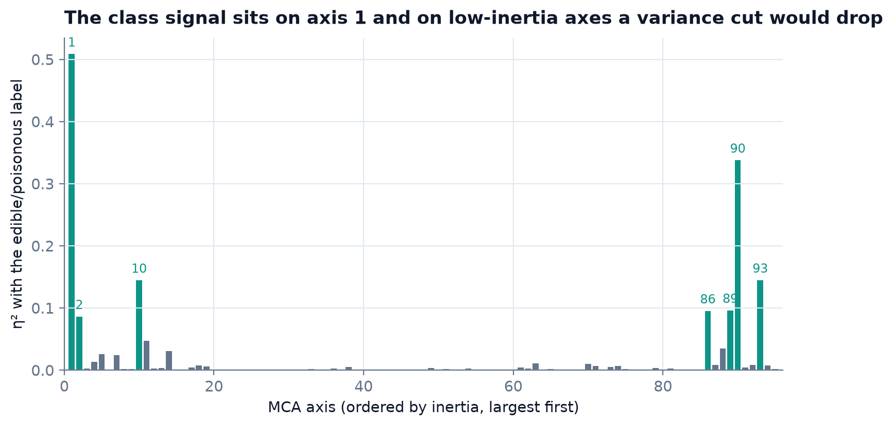
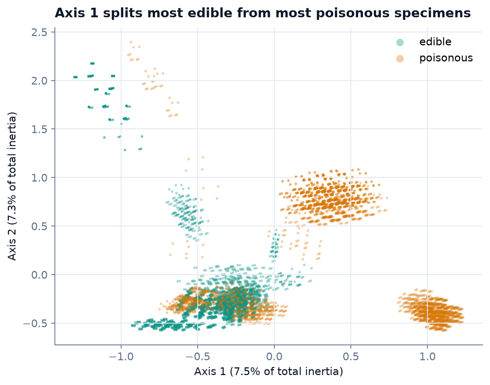
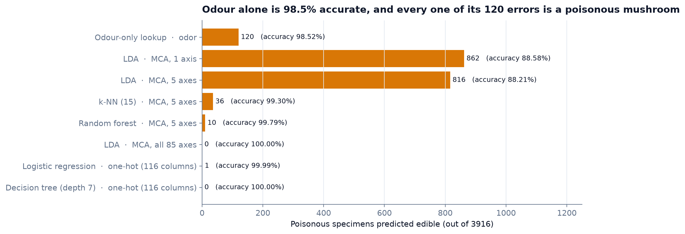
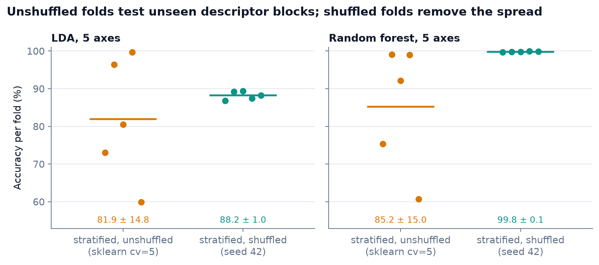
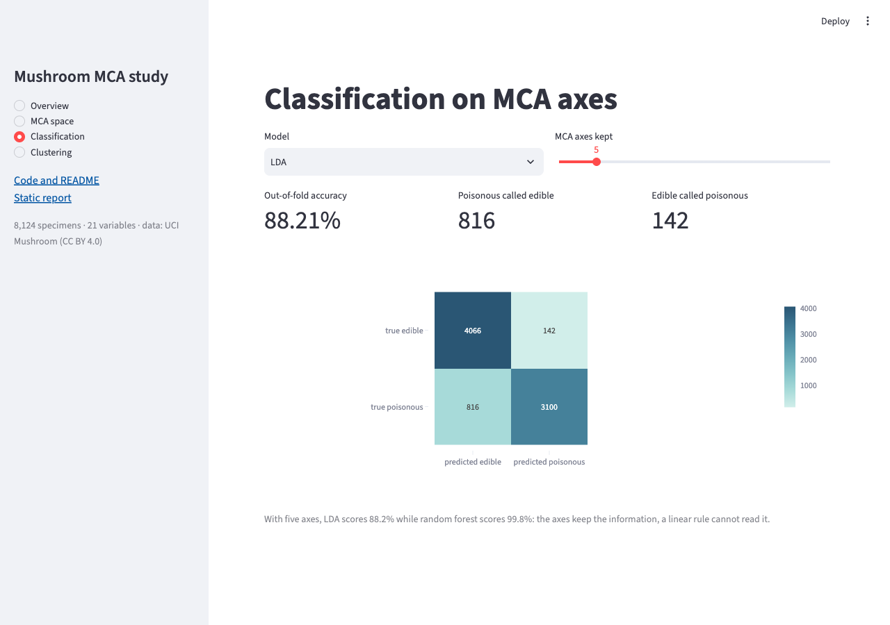

# mushroom-project

**Five multiple correspondence analysis (MCA) axes keep enough of the toxicity signal in the UCI Mushroom data for a random forest (99.8%) but not for LDA (88.2%), and the first version of this study missed it because of unshuffled folds.**

[](https://github.com/Pchambet/mushroom-project/actions/workflows/ci.yml)

[](LICENSE)
[](https://pchambet.github.io/mushroom-project/)
[](https://pchambet-mushroom-project.streamlit.app/)

*Version française : [README.fr.md](README.fr.md)*


## TL;DR

- **The data are almost perfectly separable.** Odour alone is 98.52% accurate out of fold, and a depth-7 decision tree with 14 leaves on the one-hot table is 100% accurate. Classification is not the hard part.
- **Five MCA axes keep the signal, but not in a linear form.** On the same five axes, LDA scores 88.2% while a random forest scores 99.8% and a 15-nearest-neighbour vote 99.3%. LDA stays at or below 88.8% up to nine axes and needs 19 axes to reach 99%. With all 85 axes it is 100% accurate, because the label is an exact linear function of the 116 indicator columns: what LDA cannot read is the five-axis compression, not the data.
- **Inertia is not relevance.** Axis 1 carries half the label (η² = 0.51); axes 2 to 9 carry at most 0.09, while axis 10, with only 2.3% of the inertia, reaches 0.14, and LDA jumps from 88.3% to 95.5% when it enters. Choosing axes by explained inertia throws away part of what a supervised model needs.
- **The decision-relevant error is asymmetric.** All 120 errors of the odour rule are poisonous mushrooms called edible (odourless poisonous species); LDA on five axes makes 816 such errors, the random forest 10.
- **The first version of this project misread its cross-validation.** scikit-learn's `cv=5` is stratified but not shuffled, and the UCI file is ordered by descriptor pattern (roughly by species), so each test fold was a contiguous block whose categories may never appear in training. The resulting ±14.8-point spread was read as an "unstable model" and an "overfitting" random forest. With shuffled stratified folds the spread is ±1.0 point and the random forest is the best model on MCA axes.

## Why it matters

Correspondence analysis is the standard way to turn questionnaires, product attributes or inspection checklists into a few numeric axes before clustering or modelling. The usual recipe, "keep the axes that explain most inertia, then fit a simple model", assumes that the axes that summarise the data best are also the ones that predict best, and that a linear model can read them. This study measures both assumptions on a dataset where the right answer is known, and shows how a validation mistake can produce a convincing but false story.

## Approach

1. **Data.** UCI Mushroom (8,124 specimens, 22 descriptors, edible or poisonous), downloaded once and checksum-verified. Codes are decoded with the UCI codebook; the 2,480 unknown `stalk-root` values are kept as a `missing` category rather than imputed; the constant `veil-type` is dropped. Result: 21 variables, 116 categories and 85 MCA axes with non-zero inertia (the bound J − Q = 95 is not reached because some descriptors are exactly redundant).
2. **MCA.** A short numpy implementation ([`src/mushroom/mca.py`](src/mushroom/mca.py)) written as a scikit-learn transformer, so it is refitted inside each training fold and test folds are projected with the transition formula. It keeps only axes above the numerical-rank tolerance, and its eigenvalues and coordinates match the `prince` library (tested).
3. **Evaluation.** Five shuffled, stratified folds (`random_state=42`) for every score; the MCA, encoder and classifier all live in one pipeline. Besides accuracy, every model reports how many poisonous specimens it calls edible.
4. **Comparisons.** LDA (linear, with Ledoit-Wolf shrinkage), k-NN (local) and random forest (flexible) on 1 to 85 MCA axes; odour-only lookup, logistic regression and decision trees on the one-hot table; K-means on five axes for the unsupervised view.

## Results

### Which axes carry the label



η² is the share of an axis' variance explained by the label. Axis 1 is built by `ring-type = large`, silky stalk surfaces, `odor = foul` and `spore-print-color = chocolate` (categories whose specimens are 93.8 to 100% poisonous). The first five axes hold 31.8% of the total inertia (81.6% after Benzécri's correction). After axis 1, the axis most related to the label is axis 10 (η² = 0.145 for 2.3% of the inertia), ahead of axis 2 (0.086) and axes 11 and 14 (0.047 and 0.031); every other axis stays below 0.03.



### The error that matters



| Model | Features | Accuracy (%) | Poisonous → edible | Edible → poisonous |
|---|---|---:|---:|---:|
| Majority class | none | 51.80 ± 0.02 | 3,916 | 0 |
| Odour-only lookup | `odor` | 98.52 ± 0.27 | 120 | 0 |
| LDA | MCA, 1 axis | 88.58 ± 0.68 | 862 | 66 |
| LDA | MCA, 5 axes | 88.21 ± 0.97 | 816 | 142 |
| k-NN (15) | MCA, 5 axes | 99.30 ± 0.14 | 36 | 21 |
| Random forest | MCA, 5 axes | 99.79 ± 0.08 | 10 | 7 |
| LDA | MCA, all 85 axes | 100.00 ± 0.00 | 0 | 0 |
| LDA, no shrinkage (sklearn default) | MCA, all 85 axes | 64.54 ± 6.74 | 1,686 | 1,195 |
| Logistic regression | one-hot (116 columns) | 99.99 ± 0.02 | 1 | 0 |
| Decision tree (depth 7) | one-hot (116 columns) | 100.00 ± 0.00 | 0 | 0 |

Mean ± standard deviation over the five folds; the no-shrinkage row is a solver failure explained under limitations; error counts are out-of-fold over all 8,124 specimens ([`reports/tables/reference_models.csv`](reports/tables/reference_models.csv)).

### Why the earlier conclusions were wrong



scikit-learn's `cv=5` is stratified but not shuffled. Every unshuffled test fold is 48.2% poisonous, so the class mix is not the problem. The UCI file is ordered by descriptor pattern (roughly by species), so each test fold is a contiguous block whose categories may never appear in training: in fold 5, 346 of the 1,624 specimens carry one of 14 categories that its training folds never show, while folds 2 and 4 have none ([`fold_ordering.csv`](reports/tables/fold_ordering.csv)). Shuffled folds have none at all. Re-running that protocol on the current pipeline gives LDA 81.9% ± 14.8% and random forest 85.2% ± 15.0% on five axes; shuffled folds give 88.2% ± 1.0% and 99.8% ± 0.1%. The first version of this README read the spread as instability, read the random forest's train/test gap as overfitting, picked "k = 4 axes" as optimal from noise, stated that 8 axes hold 90% of the information (they hold 90% of the *first ten* axes, which together hold 48.3% of the total inertia), and described edible recall (97.6%) as "when the model says edible, it is right 97.6% of the time" (that is precision, which was 83.5%). All of these are corrected here. The unshuffled spread is not pure noise either: it is a rough proxy for performance on species missing from training, which shuffled folds cannot measure (see limitations).

### Clusters without labels

K-means (k = 3) on the first five axes recovers part of the structure: adjusted Rand index 0.38 against the label. One cluster is 100% poisonous (1,296 specimens), one is 81.5% poisonous (2,212) and the largest is 17.7% poisonous (4,616): useful for description, not for a decision.

### Interactive views

The [static report](https://pchambet.github.io/mushroom-project/) has the interactive charts. The [Streamlit dashboard](https://pchambet-mushroom-project.streamlit.app/) lets you pick a model and a number of axes and re-runs the cross-validation live (the free hosting tier sleeps when idle; the first load takes a minute).



## Reproduce

```bash
git clone https://github.com/Pchambet/mushroom-project.git && cd mushroom-project
make setup     # uv sync --locked (Python 3.12)
make data      # download + verify the UCI file (373 KB), write data/processed/mushroom.csv
make run       # every experiment, tables in reports/, figures in docs/figures/ (about 3 min wall clock on a laptop, about 5 min CPU)
make report    # site/index.html
make app       # optional: the Streamlit dashboard
make test lint
```

Everything runs on a laptop CPU (random forests use three cores); the environment takes about 570 MB of disk. `uv run mushroom all` chains data, run and report. Re-running it reproduces the committed tables, `results.json` and figures byte for byte (checked on macOS arm64).

## Repository layout

```
src/mushroom/
  data.py         download, checksum, codebook decoding
  mca.py          MCA as a scikit-learn transformer
  experiments.py  every cross-validated experiment
  pipeline.py     runs them, writes reports/tables/*.csv and reports/results.json
  figures.py      README figures (docs/figures/)
  report.py       static HTML report (site/index.html)
  cli.py          `mushroom {data,run,figures,report,all}`
app.py            Streamlit dashboard
tests/            unit tests on a 301-row fixture of the real file (offline, a few seconds)
reports/          tables/*.csv + results.json (every number quoted)
docs/figures/     README figures
site/index.html   static report
data/processed/mushroom.csv  decoded copy, committed so the hosted dashboard starts without a download (CC BY 4.0)
```

## Methodology notes and limitations

- **Hypothetical specimens.** The UCI records are hypothetical samples generated from *The Audubon Society Field Guide to North American Mushrooms* for 23 species of *Agaricus* and *Lepiota*, not field observations. Specimens of the same species land in both training and test folds, so the scores measure recognition within known species, not generalisation to a new one; the file has no species label to build group-wise folds. The unshuffled folds above are the closest thing in this repository to that harder test, and they score far lower on their worst blocks (about 60% for both LDA and the random forest on fold 5). Nothing here is foraging advice.
- **Descriptive MCA outputs** (η², the axis-1 table, clusters) are computed on the full dataset; all supervised scores refit the MCA per fold.
- **η² is computed one axis at a time.** It shows where the label lives, not how axes combine. It does line up with the curve: LDA jumps from 88.3% to 95.5% exactly when axis 10 (η² = 0.14) enters.
- **Numerical rank.** J − Q = 95 is an upper bound. The centred indicator matrix has rank 85; the ten remaining singular values sit below numpy's matrix-rank tolerance (rounding error) and are dropped. Keeping them is not harmless: the rounding noise is a deterministic function of each row's category pattern, so a null axis can correlate with the label: in an earlier version that kept them, rounding-error axis 90 reached η² = 0.34, more than any real axis except axis 1, and default LDA, which rescales every column to unit variance, can learn from such an axis.
- **LDA solver.** The label is an exact linear function of the indicators (least-squares residual 2e-14), so with all 85 axes the within-class covariance is singular along the very direction that separates the classes. scikit-learn's default SVD solver discards that direction and scores 64.5%; Ledoit-Wolf shrinkage keeps it and scores 100%. Up to 80 axes the two solvers never differ by more than 4 specimens (both curves are in [`axis_curve.csv`](reports/tables/axis_curve.csv)); shrinkage is used throughout.
- **Five folds, one seed.** Fold-to-fold standard deviations are reported; differences below about one standard deviation (for example LDA on one axis versus five axes, 88.58 ± 0.68 against 88.21 ± 0.97) should not be over-read.
- **Model choices are deliberately plain** (shrinkage LDA, k-NN with k = 15, 200-tree random forest); no hyperparameter search was run, which keeps the comparison about the representation rather than the tuning.

## References

- *Mushroom* [Dataset] (1981), donated by J. Schlimmer. UCI Machine Learning Repository. https://doi.org/10.24432/C5959T (CC BY 4.0).
- Greenacre, M. (2017). *Correspondence Analysis in Practice*, 3rd ed. CRC Press.
- Benzécri, J.-P. (1979). Sur le calcul des taux d'inertie dans l'analyse d'un questionnaire. *Cahiers de l'Analyse des Données*, 4(3), 377–378.
- Abdi, H., & Valentin, D. (2007). Multiple correspondence analysis. In *Encyclopedia of Measurement and Statistics*. Sage.
- Halford, M. *prince*: multivariate exploratory data analysis in Python (used only as a test reference).

---

Built by [Pierre Chambet](https://github.com/Pchambet) — decision science for operations under uncertainty.
